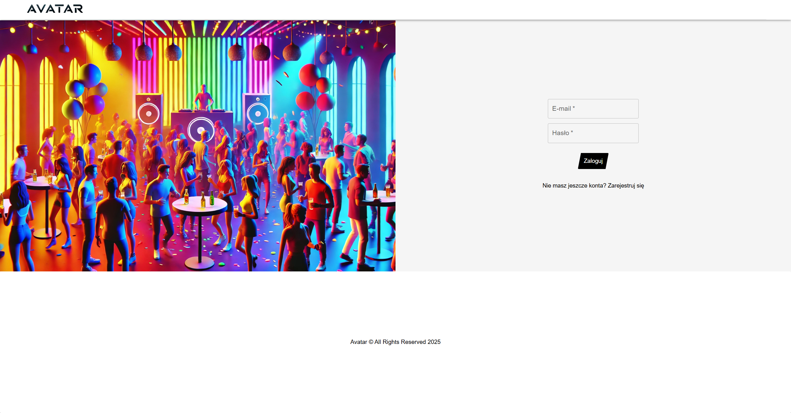
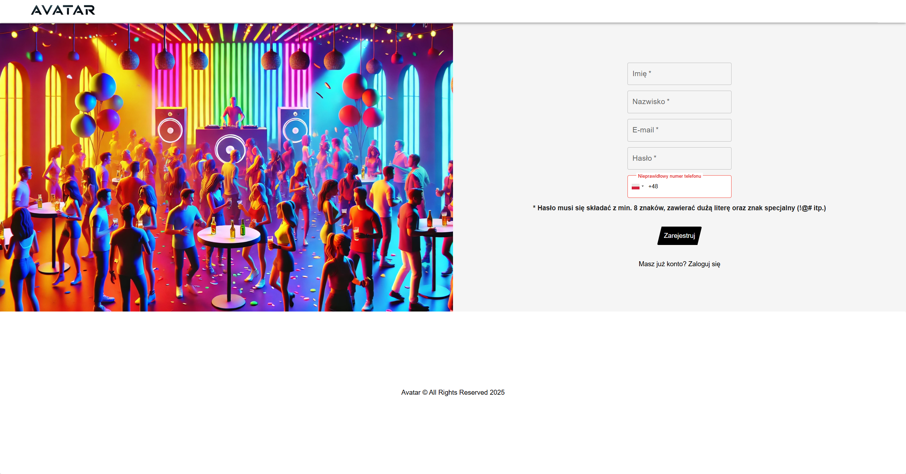
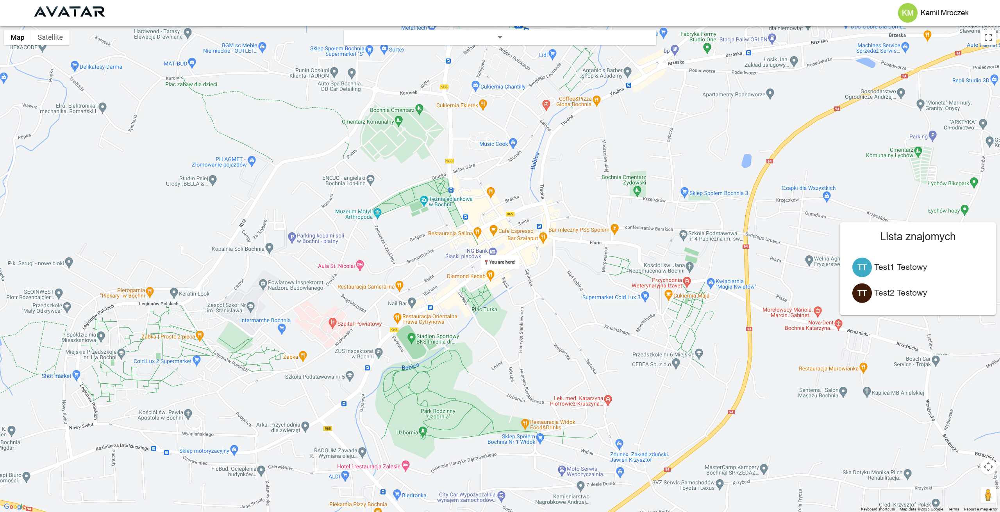
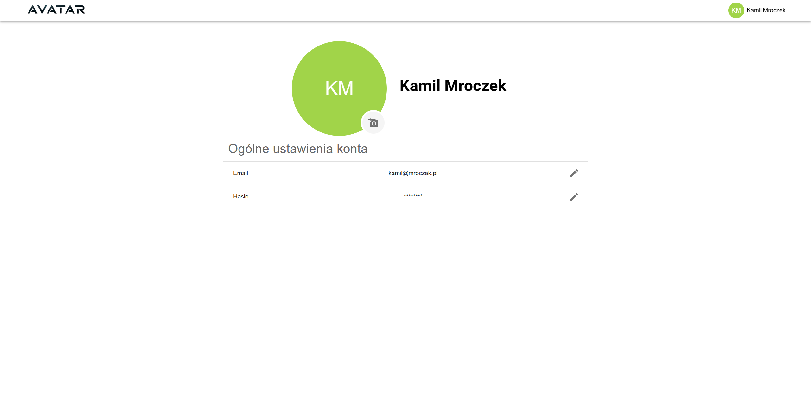
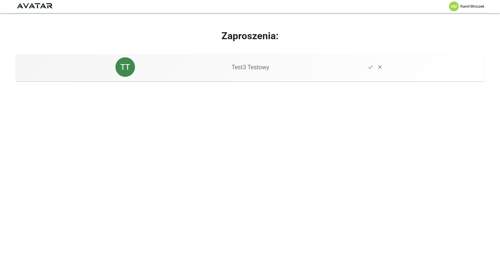
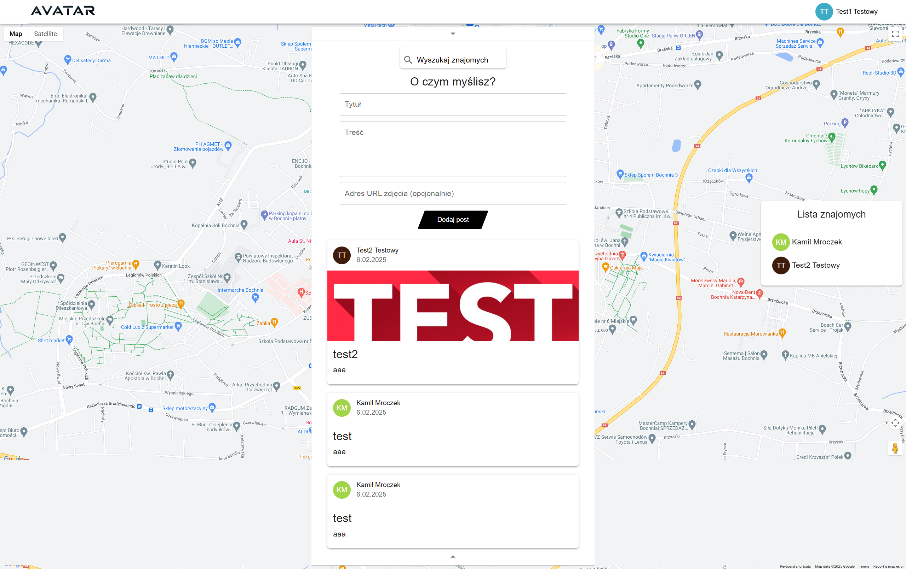

# Avatar

Demo system of a social platform.

# Table of Contents

1. [Features](#features)
2. [Technology Stack](#technology-stack)
3. [Database Design and Structure](#database-design-and-structure)
4. [Installation](#installation)
5. [Views](#views)
6. [License](#license)

## Features

- **Registering User**
- **Logging In User**
- **Searching For User:** Search for user using a search bar.
- **Adding Friend:** Add a friend using a button.
- **Cancelling Friend Request:** Cancel a friend request using a button.
- **Accepting Friend Request:** Accept a friend request using a button
- **Rejecting Friend Request:** Reject a friend request using a button.
- **Listing Friends:** List friends using a list.
- **Adding Post:** Add a post using a form.
- **Listing Posts:** List posts using a list.

## Technology Stack

Project is built using a variety of technologies and tools to ensure efficiency, performance, and scalability. Below is a list of the key components:

1. **Front-End:**
   - React TypeScript: For structuring and client-side logic.
   - Material UI: For creating components.
   - Styled Components: For styling components.
   - React Query: For queries.

2. **Back-End:**
   - Nest: For structuring and server-side logic.
   - PostgreSQL: Robust and scalable database management system.
   - Prisma: For interacting with a database.
   - Redis: For caching user and access token.

3. **Version Control:**
   - Git: For source code management.
   - GitHub: For hosting the repository and facilitating version control and collaboration.

## Database Design and Structure

The project includes a comprehensive design and structure for the database, ensuring efficient data storage and retrieval. Here are the key components:

1. **Entity-Relationship Diagram (ERD):**
   - The `erd.png` file in the main directory provides a visual representation of the database schema. This diagram is useful for understanding the relationships between different entities in the database.
   - [View ERD](./readme/erd.png)

2. **Database Schema:**
   - The `script.sql` file contains the SQL commands to create the database structure. It defines tables, relationships, and other database elements.
   - [View Database Script](./readme/script.sql)

## Design patterns

1. **RSM (Resolver-Service-Module)**
   - Separates the server into Resolvers, Services, and Modules.
   - **Example**: [api/src/friends/friends.resolver](./api/src/friends/friends.resolver), [api/src/friends/friends.service](./api/src/friends/friends.service), [api/src/friends/friends.module](./api/src/friends/friends.module)
   

## Installation

Follow these steps to get the project up and running:

1. **Install PostgreSQL**
2. **Create database 'avatar'**
3. **Install Redis**
4. **Run Redis using 'sudo service redis-server start'**
5. **Clone the Repository**
6. **Navigate to the 'api' Directory**
7. **Open Console and Run 'npm start'**
8. **Navigate to the 'avatar' Directory**
9. **Open New Console and Run 'npm start'**
10. **Access the Application:**
Now you can access the application through your web browser on localhost:3000.
You can access playground through your web browser on localhost:5000/graphql.

## Views

## License

This project is licensed under the MIT License
